<div align="center">

# Framelo

### Create. Animate. Showcase.

A browser-based device mockup and animation studio. Drop a screenshot onto a
photorealistic 3D device, animate it on a real keyframe timeline, preview it,
and export in seconds.

Created and maintained by [**ChamathDilshanC**](https://github.com/ChamathDilshanC).

[](https://nextjs.org)
[](https://react.dev)
[](https://www.typescriptlang.org)
[](https://threejs.org)
[](https://tailwindcss.com)
[](https://supabase.com)
[](LICENSE)

```
Upload  →  Place  →  Transform  →  Animate  →  Preview  →  Save  →  Export
```

</div>

---

## Table of contents

- [Why Framelo](#why-framelo)
- [Features and screenshots](#features-and-screenshots)
- [Quick start](#quick-start)
- [The core loop](#the-core-loop)
- [Routes](#routes)
- [Tech stack](#tech-stack)
- [Project structure](#project-structure)
- [Architecture](#architecture)
- [Backend setup (optional)](#backend-setup-optional)
- [Google sign-in (optional)](#google-sign-in-optional)
- [Scripts](#scripts)
- [Roadmap](#roadmap)
- [Third-party 3D models](#third-party-3d-models)
- [License](#license)

---

## Why Framelo

Most mockup tools give you a static frame and a PNG. Framelo gives you a real
scene: a normalised 3D device, a shader-driven screen, a keyframe timeline, and
a background layer that stays genuinely transparent on export.

| | |
|---|---|
| **Local-first** | Every read is answered from the browser, every write lands in IndexedDB before the network is touched. Offline is a normal state, not an error. |
| **No backend required** | The editor, patterns, device finishes and export all work fully signed out. Supabase is opt-in. |
| **Real keyframes** | Position, rotation, scale and opacity animate on a scrubbable timeline with easing curves — not CSS presets. |
| **Photoreal devices** | GLB models with per-model orientation and UV correction, plus material finishes derived live from the import. |
| **Shareable** | One click publishes a public link that autoplays on open, or lists the piece on your portfolio profile. |
| **Safe by construction** | User CSS is validated against an allowlist on the way in, out of storage, and again before it reaches the DOM. Nothing pasted is ever evaluated. |

---

## Features and screenshots

Framelo includes a complete local editor with optional cloud publishing:

| Feature | Included tools |
| --- | --- |
| Projects | Create, rename, duplicate, save and reopen local compositions |
| Devices | Real iPhone, iPad and MacBook models; independent screens and material finishes |
| Screen media | PNG, JPG, WebP, MP4 and WebM; fit, brightness, contrast and saturation controls |
| Templates | Categorized Mobile, Tablet, Laptop and Multi-device scenes with editable layers |
| Typography | Font library, text styling, motion presets and device-screen alignment |
| Animation | Transform keyframes, easing editor, presets, timeline scrubbing and playback |
| Backgrounds | Solid colours, gradients, patterns, custom CSS, images and transparency |
| Composition | Canvas dimensions, frame rate, duration, camera views and layer ordering |
| Export | PNG, JPG, WebP, MP4 and WebM; video support depends on browser codec availability |
| Sharing | Optional accounts, cloud sync, public project links and portfolio publishing |
| Preferences | Theme settings, keyboard shortcuts and undo/redo |

The six premium device templates are **Crimson Editorial Tablet**, **Neon
Portfolio Tablet**, **Midnight Sales Laptop**, **Floating Commerce Laptop**,
**Amber Agency Ecosystem** and **Lime Digital Campaign**. They use 1080 × 1350
portrait canvases, original artwork and native editable animation tracks.
Each ecosystem contains three independent device layers.

### Visual tour

The quickest way to understand Framelo is to see the full creative workflow:
start with a blank project, choose a device composition, refine every layer,
and export a polished motion piece.

<table>
  <tr>
    <td width="50%">
      <a href="docs/screenshots/01-landing.png">
        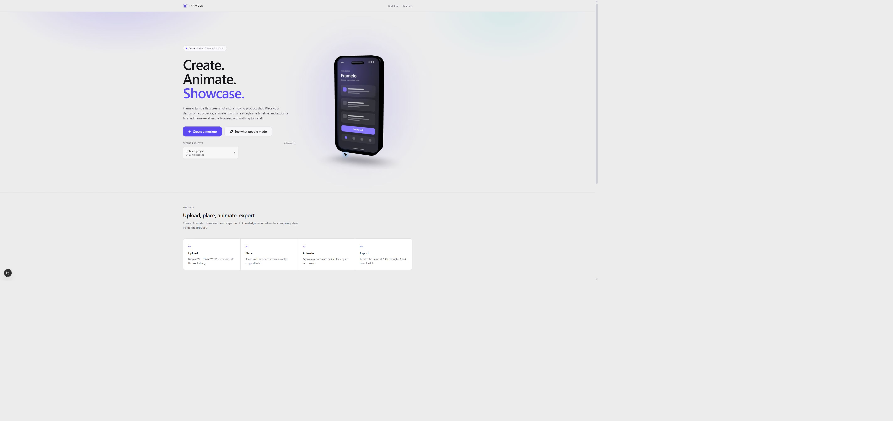
      </a>
      <br><strong>01 · Start with a clear canvas</strong><br>
      <sub>A focused landing page that takes a project from idea to first frame.</sub>
    </td>
    <td width="50%">
      <a href="docs/screenshots/02-project-dashboard.png">
        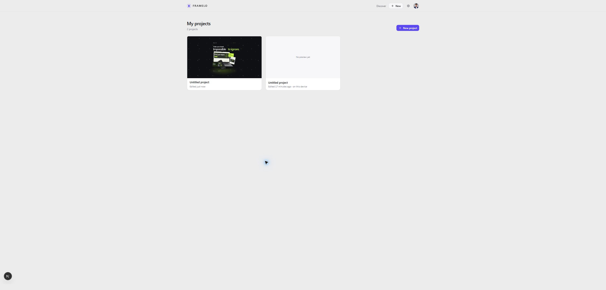
      </a>
      <br><strong>02 · Keep every project close</strong><br>
      <sub>A local-first dashboard for creating, reopening and managing compositions.</sub>
    </td>
  </tr>
  <tr>
    <td>
      <a href="docs/screenshots/03-create-project.png">
        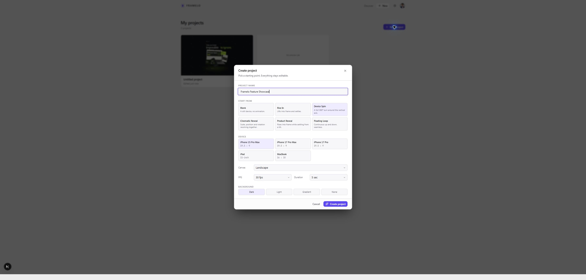
      </a>
      <br><strong>03 · Define the scene</strong><br>
      <sub>Choose the device, canvas, background and starting motion before entering the studio.</sub>
    </td>
    <td>
      <a href="docs/screenshots/04-editor-devices.png">
        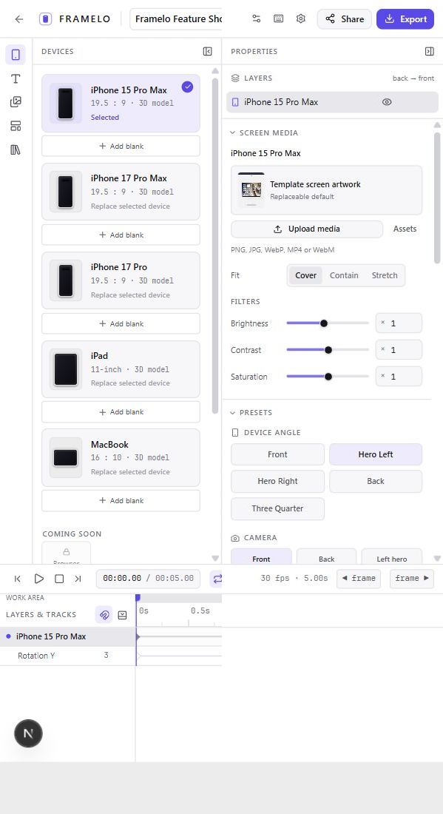
      </a>
      <br><strong>04 · Shape the composition</strong><br>
      <sub>Work directly with 3D devices, layers, transforms and a real animation timeline.</sub>
    </td>
  </tr>
</table>

#### Explore the template system

Framelo ships with responsive template categories and six premium scenes, each
editable rather than locked to a single screenshot.

<table>
  <tr>
    <td><a href="docs/screenshots/05-mobile-templates.png">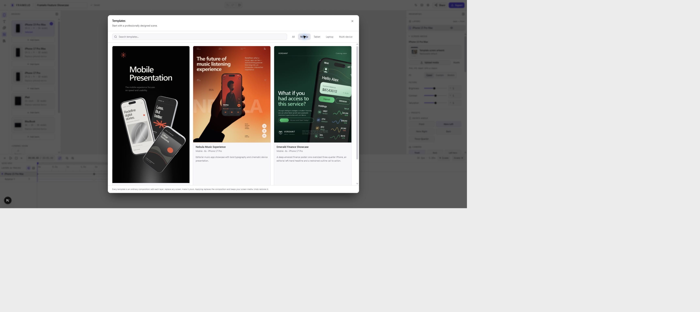</a><br><strong>Mobile</strong><br><sub>Compact device compositions for product moments.</sub></td>
    <td><a href="docs/screenshots/06-tablet-templates.png">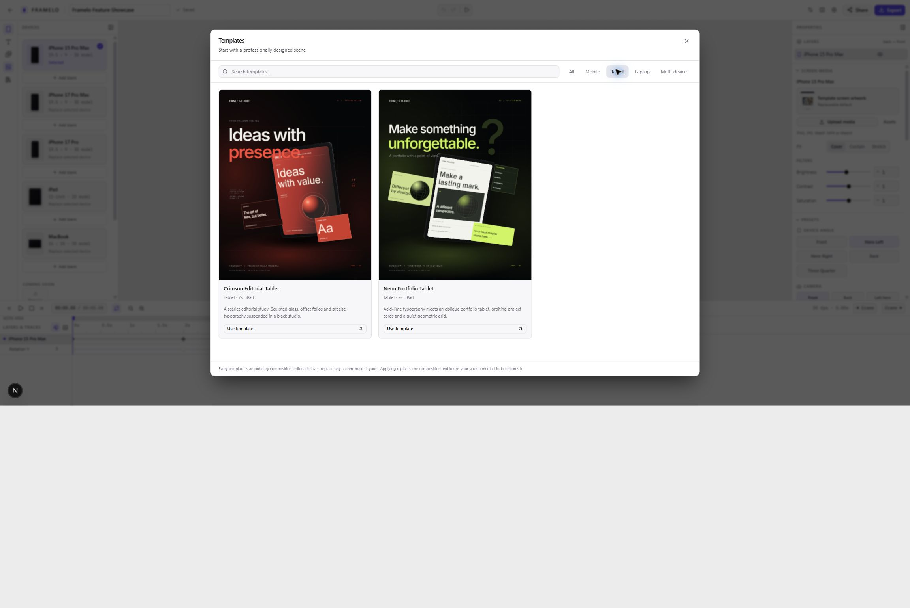</a><br><strong>Tablet</strong><br><sub>Editorial and portfolio-ready portrait scenes.</sub></td>
    <td><a href="docs/screenshots/09-laptop-templates.png">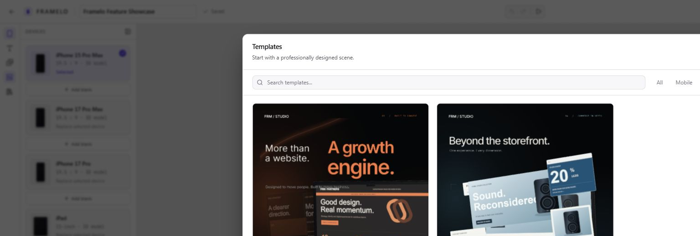</a><br><strong>Laptop</strong><br><sub>Wide compositions for campaigns and commerce.</sub></td>
    <td><a href="docs/screenshots/12-multi-device-templates.png">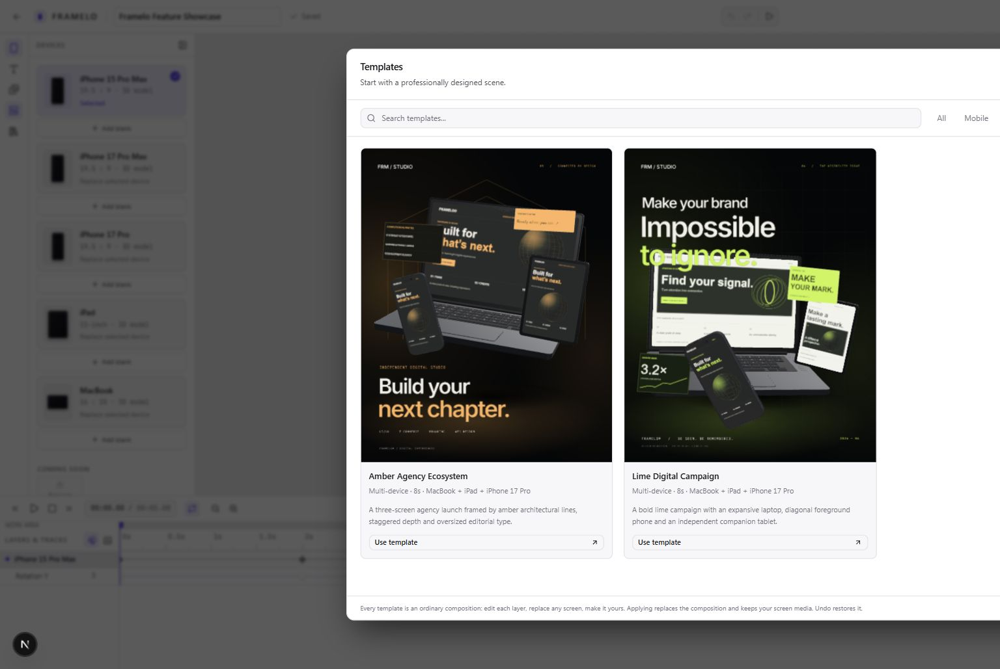</a><br><strong>Multi-device</strong><br><sub>Coordinated ecosystems with independent layers.</sub></td>
  </tr>
</table>

<table>
  <tr>
    <td><a href="docs/screenshots/07-crimson-editorial-tablet.png">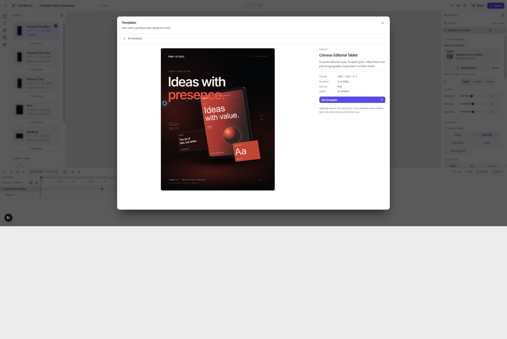</a><br><strong>Crimson Editorial</strong><br><sub>A refined tablet scene for visual stories.</sub></td>
    <td><a href="docs/screenshots/08-neon-portfolio-tablet.png">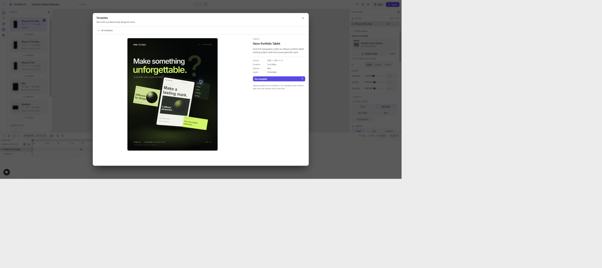</a><br><strong>Neon Portfolio</strong><br><sub>A high-contrast showcase for standout work.</sub></td>
    <td><a href="docs/screenshots/10-midnight-sales-laptop.png">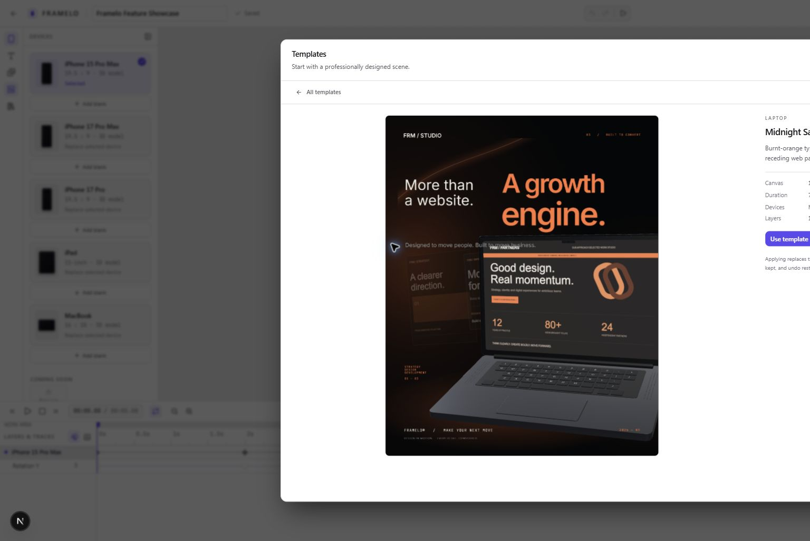</a><br><strong>Midnight Sales</strong><br><sub>A dark, cinematic laptop composition.</sub></td>
  </tr>
  <tr>
    <td><a href="docs/screenshots/11-floating-commerce-laptop.png">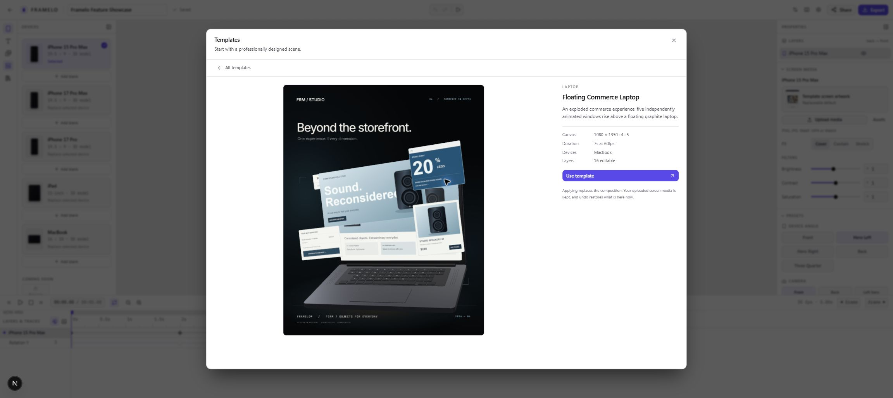</a><br><strong>Floating Commerce</strong><br><sub>Product-led motion with a sense of depth.</sub></td>
    <td><a href="docs/screenshots/13-amber-agency-ecosystem.png">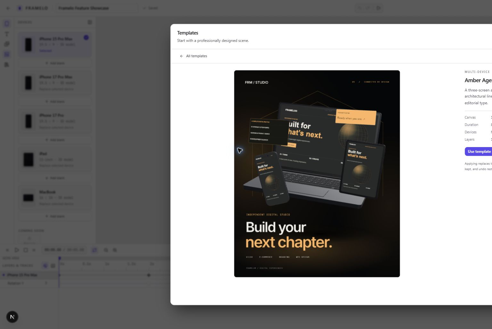</a><br><strong>Amber Agency</strong><br><sub>A warm, coordinated three-device system.</sub></td>
    <td><a href="docs/screenshots/14-lime-digital-campaign.png">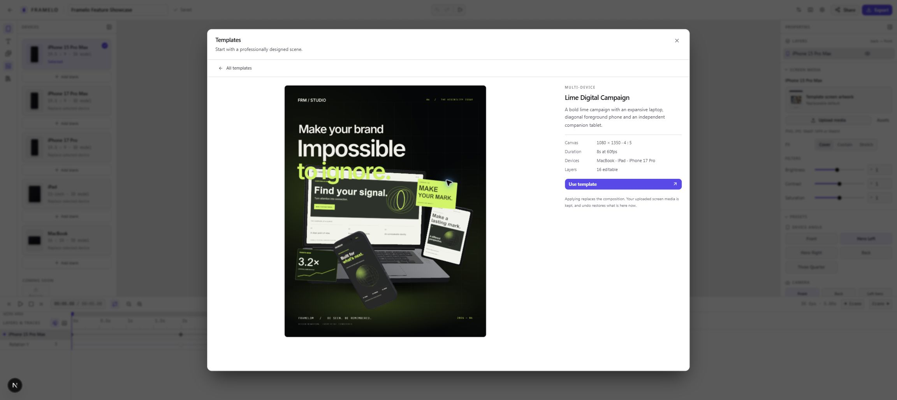</a><br><strong>Lime Digital Campaign</strong><br><sub>A bright campaign system built for motion.</sub></td>
  </tr>
</table>

#### Edit, animate and export

The editor keeps the important controls visible without losing the visual
focus: assign screen media, tune the composition, use shortcuts, and prepare
the final export from one studio.

<table>
  <tr>
    <td width="33%"><a href="docs/screenshots/15-multi-device-editor.png">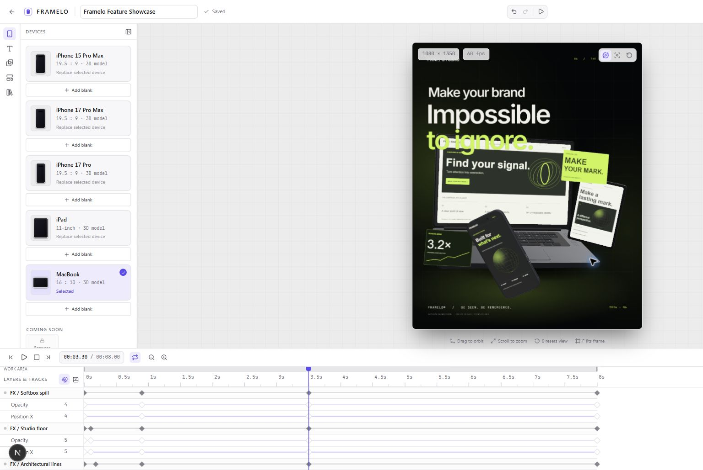</a><br><strong>Animate the scene</strong><br><sub>Independent device layers, screen media and motion in one composition.</sub></td>
    <td width="33%"><a href="docs/screenshots/16-composition-settings.png">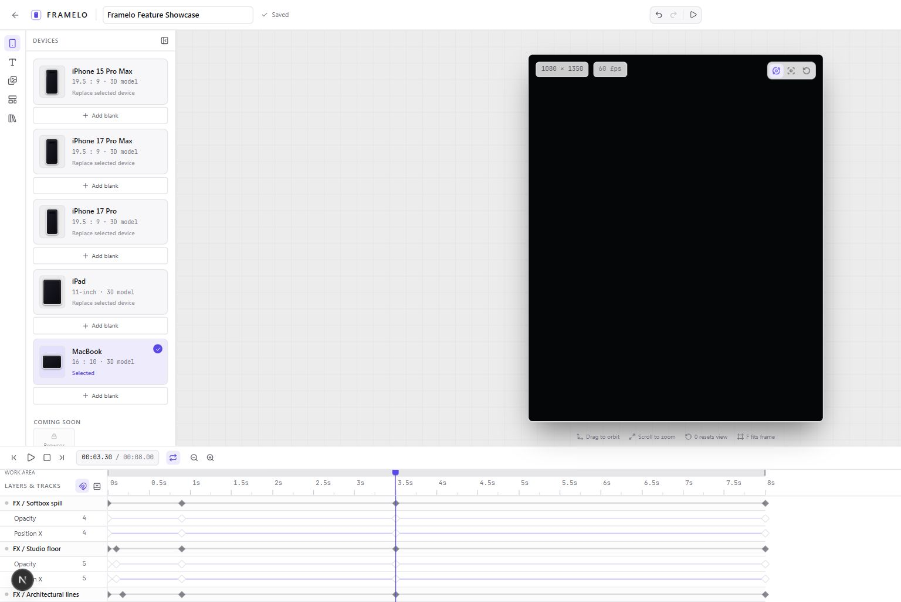</a><br><strong>Set the output</strong><br><sub>Control dimensions, duration, frame rate and camera presentation.</sub></td>
    <td width="33%"><a href="docs/screenshots/18-assets-screen-media.png">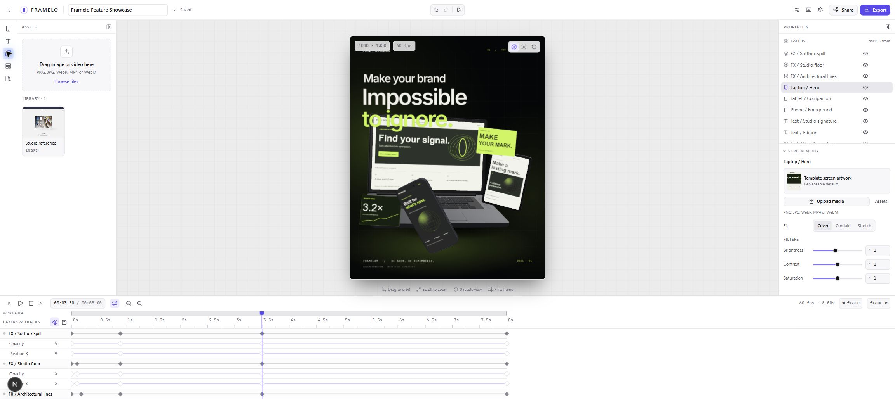</a><br><strong>Make it yours</strong><br><sub>Bring in screen media and tune how it sits inside every device.</sub></td>
  </tr>
</table>

Keyboard-driven workflows are supported too:

<p align="center">
  <a href="docs/screenshots/17-keyboard-shortcuts.png">
    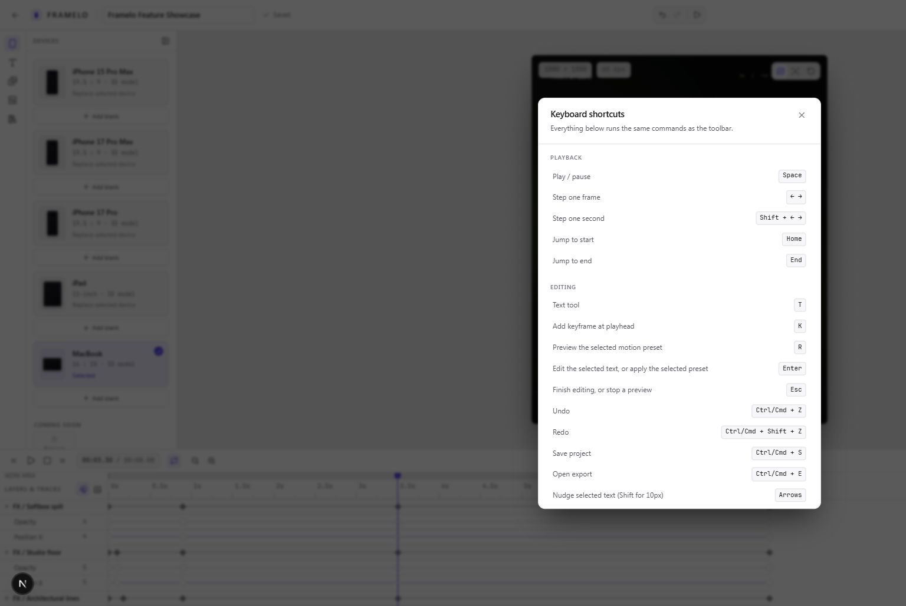
  </a>
</p>

<p align="center"><sub>Every capture above opens at full resolution. See the <a href="docs/screenshots/README.md">complete capture index</a> for coverage details.</sub></p>

---

## Quick start

**Requirements** — Node 20+ and a browser with WebGL2.

```bash
git clone https://github.com/ChamathDilshanC/Framelo.git
cd Framelo
npm install
npm run dev          # http://localhost:3000
```

That is the whole setup. Framelo runs with **no backend at all**: projects go to
IndexedDB, media to IndexedDB, and the editor, patterns and export all work
signed out.

Adding a Supabase project turns on accounts, cloud sync, share links and
portfolios — see [Backend setup](#backend-setup-optional).

```bash
cp .env.example .env.local   # only needed for the optional backend
```

> [!IMPORTANT]
> Never put a Supabase `service_role` key (or an `sb_secret_...` key) in
> `.env.local`. Every `NEXT_PUBLIC_` value is compiled into the JavaScript sent
> to the browser, and service-role keys bypass row level security entirely.

---

## The core loop

1. Open `/dashboard` and click **New project** — pick a device, a starting
   animation, a canvas size and a background.
2. The editor opens with the project already animated.
3. Upload PNG/JPG/WebP images or MP4/WebM video through **Assets**, then assign
   media to each device screen independently.
4. Set the device **finish** — Natural, Dark, Light, Gold, Silver or a custom
   colour — and the screen's brightness, contrast and saturation.
5. Choose a **background**: solid, gradient, a pattern from the library, your
   own CSS pattern, an image, or none.
6. Adjust position, rotation, scale and opacity in the inspector, or apply a
   device-angle preset.
7. Click the diamond beside any property to start a keyframe track, move the
   playhead, change the value — a second keyframe is written automatically.
8. Press <kbd>Space</kbd> to play. Scrub the ruler or drag keyframes on the
   timeline.
9. <kbd>Ctrl</kbd>/<kbd>Cmd</kbd> + <kbd>E</kbd> opens export: choose a PNG,
   JPG or WebP still, or an MP4/WebM video. Video codec support depends on the
   browser; transparency is available for supported formats.
10. **Share** publishes a public link that plays on open; **Add to portfolio**
    lists it on your profile.

Projects save to IndexedDB immediately and sync to Supabase in the background
when you are signed in.

---

## Routes

| Route | What it is |
|-------|------------|
| `/` | Landing page |
| `/dashboard` · `/projects` | Your projects |
| `/editor/[projectId]` | The editor |
| `/share/[token]` | A shared project — autoplays, ships no editor code |
| `/portfolio` | Recently published work |
| `/u/[username]` | One person's portfolio |
| `/auth/callback` | OAuth code exchange |

---

## Tech stack

| Layer | Choice |
|---|---|
| Framework | Next.js 16 (App Router) · React 19 |
| Language | TypeScript 5 (strict) |
| 3D | three.js · @react-three/fiber · @react-three/drei |
| Styling | Tailwind CSS 4 · Radix UI primitives · class-variance-authority |
| Motion | Framer Motion (UI) · a custom keyframe engine (scene) |
| State | Zustand — three isolated stores |
| Validation | Zod 4 |
| Persistence | IndexedDB (source of truth) · Supabase Postgres + Storage (replica) |
| Testing | Vitest |

---

## Project structure

```
src/
├── app/                    App Router routes, layout, global styles
├── types/                  project · layer · animation · device · asset · background
├── engine/
│   ├── easing/             easing curves, registered by name
│   ├── interpolation/      lerp + eased interpolation
│   ├── animation/          evaluateTrack / evaluateTransform, presets
│   ├── scene/              texture cache, screen fitting, geometry, frame capture
│   ├── devices/            definitions · model loader · screen + material control
│   ├── background/         patterns · css-safety · resolve · rasterize
│   ├── motion/             scene motion primitives
│   ├── templates/          composable starting compositions
│   └── text/               text layer layout + measurement
├── store/
│   ├── project-store.ts    project data + command-based undo/redo
│   ├── editor-store.ts     UI state: time, playback, selection, panels
│   └── asset-store.ts      uploaded media
├── lib/
│   ├── supabase/           client · server · env · row types
│   ├── projects/           project · share · portfolio services, public queries
│   ├── storage/            ProjectStorage + AssetStorage boundaries
│   ├── validation/         Zod project schema, upload rules
│   ├── export/             ExportService
│   ├── timeline/           timeline maths and helpers
│   ├── history/            undo/redo command stack
│   └── hooks/              playback loop, autosave, shortcuts, project loading
├── components/             editor · canvas · timeline · properties · devices ·
│                           assets · library · templates · export · viewer ·
│                           dashboard · portfolio · auth · landing · ui
└── devices/                device registry

supabase/
├── schema.sql              full schema in one file
└── migrations/             init · rls · storage · patterns
```

---

## Architecture

State is split three ways and the animation engine is pure, so the preview
renderer and a future export renderer consume the same project data.

**Timeline time is the single source of truth.** `evaluateTransform(layer, t)`
derives every rendered value from it. Animated properties override the static
transform; untouched ones fall through.

**The 3D scene never re-renders React during playback.** `DeviceRenderer` reads
the clock inside `useFrame` and mutates the object graph directly.

**Devices are data.** Adding one means adding a `DeviceDefinition` and a GLB —
no renderer, canvas or store change. A definition carries the corrections that
GLB needs (base orientation, screen mesh/material names, display UV mapping,
material overrides), and every model is normalised to the same height, so one
camera framing and one set of presets work library-wide.

**The device screen is a shader, not an image edit.** Fit, brightness, contrast,
saturation and the drawn bezel are uniforms on the display material. Changing an
image swaps `emissiveMap` and nothing else — the model is never reloaded and the
source image is never rewritten.

**The procedural device is a fallback, not the default.** `FallbackDevice`
renders when a GLB fails to load, at the same normalised size — so transforms,
keyframes and export behave identically on it.

**Camera framing is saved with the project.** The editor keeps the live camera
pose, playhead and selection in editor state and restores them on reload.
Device animation remains independently editable on the timeline.

**Undo/redo is command-based** with transaction coalescing, so dragging a slider
is one history entry rather than fifty.

**Storage sits behind interfaces** (`ProjectStorage`, `AssetStorage`) so the
browser-local implementations can be swapped in place.

**Local-first, always.** Supabase is a replica, not the source of truth. That is
what keeps the editor responsive, keeps it working offline, and keeps a failed
request from losing work. The database is never in the animation loop — and
`offline` is not `error`: a failed sync means the cloud copy is behind, and the
save indicator says exactly that.

**Backgrounds are a DOM layer behind a transparent canvas**, so a CSS pattern is
a real CSS pattern, changing one costs the renderer nothing, and a transparent
export is genuinely transparent. Export composites both layers at full
resolution.

**User CSS is data, never code.** Pattern values are checked against an
allowlist of CSS functions and characters on the way in, on the way out of
storage, and again before they reach the DOM.

**Device finishes clone materials and remember the original**, so a finish is
always re-derived from the import and therefore reversible; screens, glass,
lenses and sensors are classified out of it by role.

Deeper design notes live in [`architecture.md`](architecture.md) and
[`features.md`](features.md).

---

## Backend setup (optional)

Framelo is fully usable without this. Adding Supabase enables accounts, cloud
sync, share links and portfolios.

**1. Create a project** at [supabase.com](https://supabase.com).

**2. Fill in the environment** — copy `.env.example` to `.env.local` and add the
two values from **Project settings → API Keys**:

```ini
NEXT_PUBLIC_SUPABASE_URL=https://your-project-ref.supabase.co
NEXT_PUBLIC_SUPABASE_ANON_KEY=sb_publishable_your-key-here
```

Both are browser-safe. What protects the data is the row level security in
`supabase/migrations/` — the key only says "I am an anonymous visitor", and the
policies decide what that visitor may read. Either key format works:
`sb_publishable_...` (current) or the legacy `anon` JWT.

**3. Apply the migrations:**

```bash
npx supabase link --project-ref <your-ref>
npx supabase db push
```

Or run the files in `supabase/migrations/` in order from the SQL editor.

```text
supabase/migrations/
  20260101000000_init.sql      profiles · projects · assets · shares · portfolio
  20260101000100_rls.sql       RLS on every table + get_shared_project()
  20260101000200_storage.sql   buckets + per-user storage policies
  20260101000300_patterns.sql  saved custom patterns
```

That creates the tables, indexes, RLS policies, storage buckets and storage
policies. There are no Edge Functions to deploy — ordinary editor CRUD goes
straight through the Supabase client under RLS.

---

## Google sign-in (optional)

Email and password work without it. This adds a "Continue with Google" button to
the sign-in dialog. The app side is already built (`signInWithGoogle()` in the
auth store, plus the `/auth/callback` route); what remains is console
configuration, in this order.

<details>
<summary><b>1. Google Cloud Console</b></summary>

At [console.cloud.google.com](https://console.cloud.google.com):

1. **APIs & Services → OAuth consent screen.** Pick *External*, fill in the app
   name, support email and developer email. While it stays in *Testing*, only
   accounts listed under **Test users** can sign in — add your own.
2. **APIs & Services → Credentials → Create credentials → OAuth client ID**,
   type **Web application**.
3. Under **Authorised redirect URIs** add exactly this — it is Supabase's
   callback, not Framelo's:

   ```text
   https://<your-project-ref>.supabase.co/auth/v1/callback
   ```

4. Save. Google shows a **Client ID** (`....apps.googleusercontent.com`) and a
   **Client secret** (`GOCSPX-...`).

</details>

<details>
<summary><b>2. Supabase dashboard</b></summary>

1. **Authentication → Sign In / Providers → Google.** Enable it, paste the
   Client ID and Client secret, save.
2. **Authentication → URL Configuration → Redirect URLs.** Add the origins the
   app runs on, or the callback is refused after Google approves it:

   ```text
   http://localhost:3000/**
   https://your-domain.com/**
   ```

No environment variable changes: the client secret lives in Supabase and must
never reach this repository.

</details>

<details>
<summary><b>How the redirect actually goes</b></summary>

The two callback URLs are different things, and mixing them up is the usual
cause of a failed setup:

```text
Framelo  →  Supabase /auth/v1/authorize      signInWithOAuth()
         →  Google consent screen
         →  Supabase /auth/v1/callback       ← the URL Google needs
         →  Framelo /auth/callback?code=…    ← the route in this repo
         →  session cookies set, redirect to /dashboard
```

</details>

<details>
<summary><b>Troubleshooting</b></summary>

| What you see | What it means |
|---|---|
| JSON page saying `provider is not enabled` | Step 2.1 is not done, or was not saved |
| Google's `redirect_uri_mismatch` | The URI in step 1.3 does not match your project ref exactly |
| Back on the dashboard with "sign-in did not complete" | The redirect URL from step 2.2 is missing, or the code was reused |
| `access_denied` | The consent screen is in *Testing* and the account is not a test user |

</details>

---

## Scripts

| Command | What it does |
|---|---|
| `npm run dev` | Development server on `http://localhost:3000` |
| `npm run build` | Production build |
| `npm start` | Serve the production build |
| `npm run typecheck` | `tsc --noEmit` |
| `npm run lint` | ESLint |
| `npm test` | Vitest — engine and store tests |
| `npm run test:watch` | Vitest in watch mode |

Development helpers, available on `window` in dev builds:

```js
__framelo.inspectDevice("iphone-17-pro")  // mesh + material names, UV ranges
__framelo.useFallback(true)               // exercise the fallback path by hand
```

---

## Roadmap

- [x] **Video export** — MP4 and WebM through the scene export pipeline, subject
      to browser codec support. GIF is not implemented.
- [ ] **Screen media on shared pages** — assets live in a private bucket, so the
      public viewer renders the generated placeholder screen. Publishing assets
      needs a deliberate decision about what a share link exposes.
- [x] **iPad and MacBook** — real models, replaceable screens and dedicated
      Tablet, Laptop and Multi-device templates.
- [ ] **A render worker** for heavy exports off the main thread.
- [ ] **Shape layers** alongside the existing text layers.
- [ ] **Realtime** — deliberately deferred; nothing in single-user editing
      benefits from it yet.

---

## Third-party 3D models

The photorealistic iPhone models in `public/devices/` are **third-party assets
under [CC BY 4.0](https://creativecommons.org/licenses/by/4.0/)** — not Framelo's
work and not covered by Framelo's licence. The required attribution lives in
[`public/devices/CREDITS.md`](public/devices/CREDITS.md) and is also shown in the
editor's device picker; keep both intact when redistributing.

The models, their per-model orientation/UV corrections and the material-tuning
approach came from
[Phone Mockup Studio](https://github.com/quentin-pla/phone-mockup-studio)
(MIT, Quentin PLA). Framelo integrates the assets and rendering techniques only;
its editor, timeline, animation engine and UI are its own.

These models are fan-made visualisations, not official Apple assets. "iPhone" is
a trademark of Apple Inc. Framelo is not affiliated with, authorised by, or
endorsed by Apple Inc.

---

## License

[MIT](LICENSE) © [ChamathDilshanC](https://github.com/ChamathDilshanC)

Third-party material bundled with this repository is listed in
[`NOTICE`](NOTICE) and is covered by its own terms, not by the MIT licence.

<div align="center">
<br>

**Framelo** — Create. Animate. Showcase.

</div>
